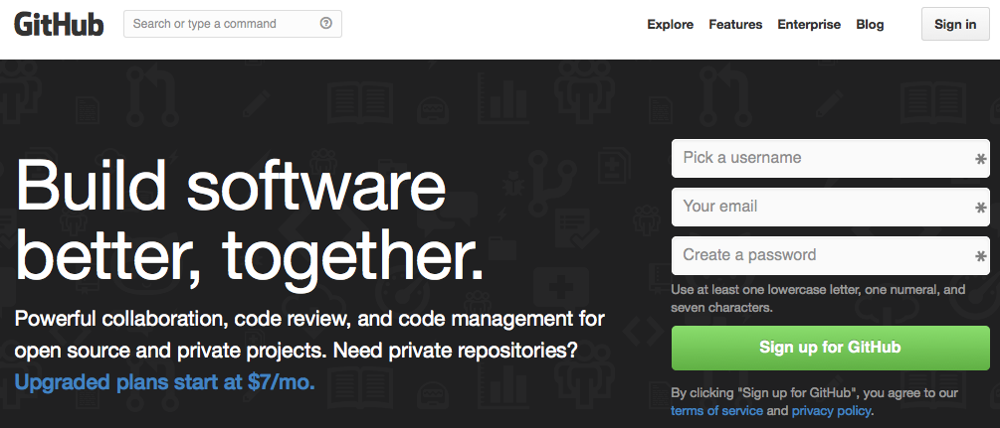
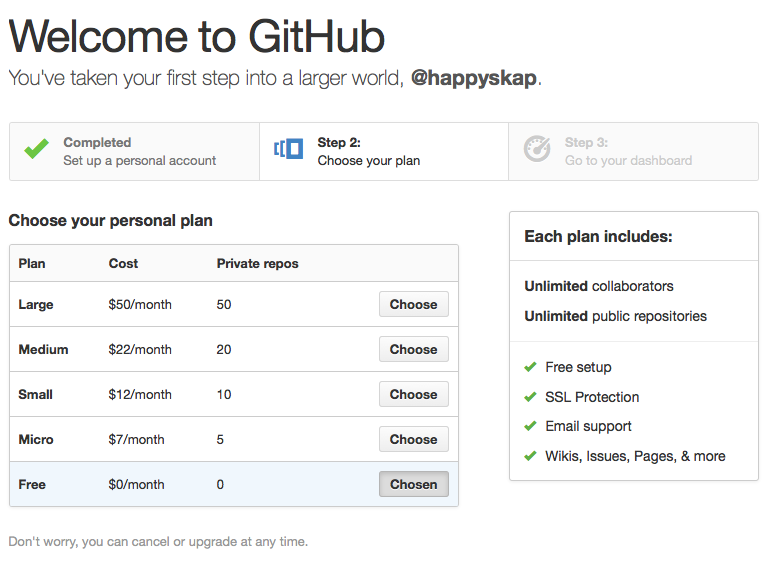
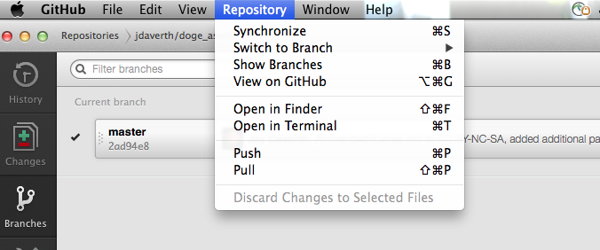
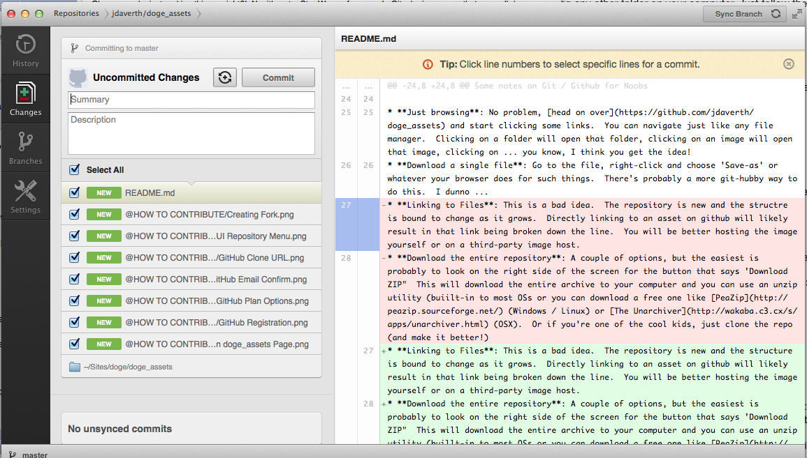
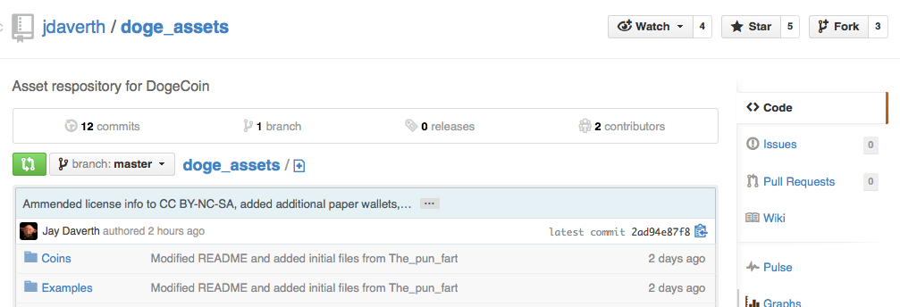
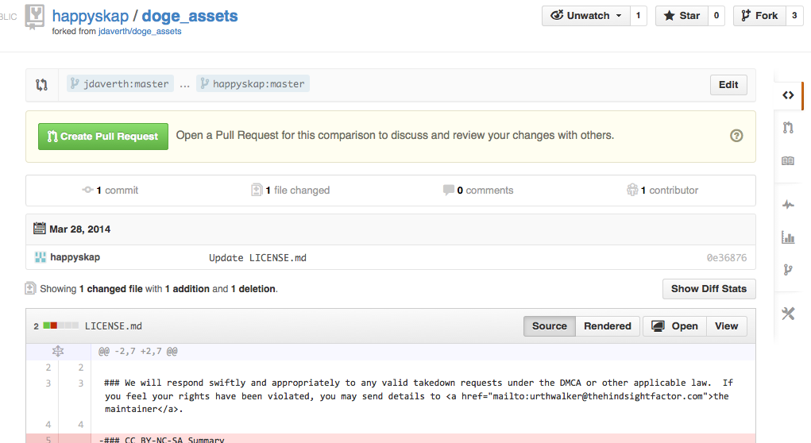

Contributing to a GitHub project is easy and fun.  No, really!  Once you get the hang of things, it is only marginally different then editing any other folder on your computer.  Just follow these steps and you'll be fine:

***

# Getting a GitHub Account

Before you can do anything, you will need a GitHub account.  Don't worry, it's completely free!

* Go to [https://github.com/](https://github.com/)

* Choose your username, provide an email address, pick a password and then click the green 'Sign up for GitHub' button.
 
* On the next screen, choose your plan (I recommend the FREE version unless you have a specific need otherwise)

* Finally, you need to verify your email.  GitHub will send an email to the address you specified -- click (or paste) the link in this email.

* You will be taken a one last page on github where you're asked to confirm your email.  Simply click the 'Confirm' button and you're ready to go!

# Forking the project

Did you say Forking?!  This is a git term that means to make a whole new project as an exact copy of the original.  This 'fork' then becomes your project to modify however you please without affecting the original.  Forking is the first step to collaborating on a group project like doge_assets.

* To begin, find the 'doge_assets project by either searching for it on GutHub or navigating to it directly at [https://github.com/jdaverth/doge_assets](https://github.com/jdaverth/doge_assets).

* Click the 'Fork' button at the top-right.  The following screen will run while your fork is being created:

* You should now be taken to a new screen that looks __almost__ the same as the last except it has your username at the top-left instead of mine (jdaverth).  Welcome to your very own fork of doge_assets!

# Making Changes

Now that you have your own fork, you can do just about whatever you want to it.  Making changes is slightly (but only slightly) more involved than simply changing the files on your computer.  The short version is as follows:

* Clone your fork.
* Make whatever changes you want to it
* Tell git to add and commit those changes
* Push the changes up to GitHub
* Make a Pull Request.

Let's go over these one at a time.

## Cloning your fork

Ok, now you're just making this up, right?!  No, it's not a Star Wars reference.  In Git, cloning means that you pull down a copy of the entire repository to your local computer.  This is not just the files that are currently there, but a complete history of all commits ever made to the project.  Don't worry, it won't take up much room on your hard drive and you can always delete it after you've committed changes back to GitHub.

Here is where Git comes in.  You can use Git either with a GUI (Graphical User Interface) like any other Windows/Mac/Linux program, or from the command line.  I'll give examples of both as we go.

* **If you're planning to use the terminal**: The first thing you need to do is to make sure git is installed.  I'm not going to advise you on this part since every system is different.  If you're comfortable with the command line, then I presume you can figure this part out on your own.
* **If you prefer to use a GUI**: You can download one directly from GitHub by clicking on the 'Clone in Desktop' button on the right.  Download the version for your computer (examples here are for OSX) and install as normal.  When you run the program for the first time, you will need to log in with your GitHub Account username and password (so it knows you have permission to change things).  This will also automatically clone your fork, so you're done!  You may now move on to the next section.
* If you're using the terminal, you will need to locate your fork's 'Clone URL' on the right.

* Click the button to the right of your clone URL to copy this to your clipboard.  GitHub defaults to the HTTPS Clone url which is fine.  You may prefer to use SSH instead by uploading a key, but if you're 'that' guy then you probably aren't reading this tutorial anyway!  
* Open a terminal and navigate to the folder where you want to keep your sites.  This can be anywhere you want (~/Sites by default on OSX).  Enter the following (replacing the URL with the one you just copied):

<code>$ git clone https://github.com/your_user_name/doge_assets.git</code>

* After git finishes doing its thing, you should now have a copy of your fork on your hard drive, in a git-managed folder, and are ready to work!

## Making Changes

This is the easy part.  All you have to do is, er ... make some changes!  You can do this in any fashion you want depending on what you want to add, remove, or modify.  If you're using the GUI and don't know where your files are, simply click on the 'Repository' Menu and click 'Open in Finder'.

Git is watching this folder (creepy smile) so whatever changes you make here, git will know about them.  So go crazy!

## Adding and committing changes

Once you're done working, you're ready to start committing.  A commit is basically a snapshot of a moment in time in your project.  You should commit often so that if you make a mistake you can roll back.  After any commit, if you want, you can also push changes back up to GitHub for extra safety, but we'll get to that.

If you've added new files, git will see these as 'untracked', meaning that it knows they have changed but they will not be added to any commits you make unless you tell git that you want this.  Adding files like this is called 'staging' and is easy-peasy.

* If you're using the terminal, you can stage files simply by adding them:
<code> $ git add filename(s)</code>

* If you're using the GUI, git skips this step for you.

Whenever you're ready to make a new 'snapshot', you can do so by writing a brief log message describing the changes and committing.  On the terminal:

<code>$ git commit -m "a brief description of changes"</code>

Of course, this is only on your local (clone) copy.  To get these into GitHub, you must also push them up:

<code>$ git push origin master</code>

From the GUI:

* Double-click on your repository to see which files are currently staged.  You can check or uncheck as desired as well as review the changes.
 

* Enter a brief description of the changes in the 'Summary' field -- this is your log entry for git.
* Optionally, you may also enter text into the 'Description' field.  This is for GitHub, not git, so will be visible only from the website.
* Clicking 'Commit' will make a new commit AND push changes up to your fork.  You're changes are now live on GitHub!

## Make a Pull Request

Now that your changes are live in your GitHub fork, your ready to make a request for them to be added to the main project:

* Click the 'Pull Requests' link on the right side

* Now click the green 'New pull request' button on the right

* This following screen lists all the differences between your commit and the main project.

* If you're happy with the changes, simply click the green 'Create Pull Request' button.  This sends a message to the maintainer (me) that you want to pull your changes into the main project so everyone can access them.  

** Congratulations, you're done!! **  I'll review your changes and either approve them or respond with comments.

# Anything else?

Like everything else, this tutorial is in GitHub as well, so please let me know if it was helpful, contains errors, or is missing anything at all.

And, uh, ahem ... I accept tips (in doge, of course) through the reddit tipbot or directly to:

DPwmYiPwdUtaWLAc3bmdtgkyzUBb6rNj8h
